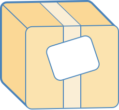

# debundle

This is a tool to decode javascript bundles produced by tools like [Webpack](https://webpack.github.io/) and [Browserify](http://browserify.org/)
into their original, pre-bundled source.

[](https://travis-ci.org/1egoman/debundler)

## Why would I want to debundle my code?
Reasons vary, but this tool was originally developed to help me with a reverse engineering project.
Needless to say, sifting through minified bundles to try and figure out how a service works isn't
fun and is a lot easier when that bundle is broken into files and those files have semantic names. 

## Installation
```
npm i -g debundle
```

## Running
```bash
$ debundle
Usage: debundle [input file] {OPTIONS}

Options:
   --input,  -i  Bundle to debundle
   --output, -o  Directory to debundle code into.
   --config, -c  Configuration file

$ curl https://raw.githubusercontent.com/1egoman/debundle/master/test_bundles/browserify/bundle.js > bundle.js
$ curl https://raw.githubusercontent.com/1egoman/debundle/master/test_bundles/browserify/debundle.config.json > debundle.config.json
$ cat debundle.config.json
{
  "type": "browserify",
  "knownPaths": {}
}
$ debundle -i bundle.js -o dist/ -c debundle.config.json
$ tree dist/
dist/
├── index.js
└── node_modules
    ├── number
    │   └── index.js
    └── uuid
        ├── index.js
        ├── lib
        │   ├── bytesToUuid.js
        │   └── rng.js
        ├── v1.js
        └── v4.js
4 directories, 7 files
```

# Configuration

## Simple configuration
```
{
  "type": "browserify",
  "entryPoint": 1,
  "knownPaths": {}
}
```

(To debundle a simple Webpack bundle, replace `browserify` the above configuration with `webpack`)

A configuration can have a number of flags - they are documented in [DOCS.md](DOCS.md).

# Contributing
- After cloning down the project, run `npm install` - that should be it.
- Debundler entry point is `./src/index.js` (that's how you run it!)
- A bunch of sample bundles are in `test_bundles/`. A script, `test_bundles/run_test.sh` can run the
  debundler against a given bundle and try to debundle it into `dist/`. (CI will, as part of running
  tests, debundle all the bundles in that folder.)
- Make sure any contribution pass the tests: `npm test`

# Legal note
Some companies specify in their terms of service that their code cannot be "reverse engineered".
Debundling can definitely (depending on how you're using the code) fall under that umbrella.
Understand what you are doing so you don't break any agreements :smile:
